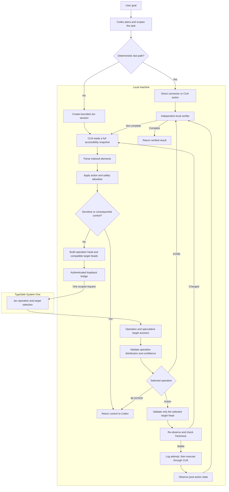

# Jev Desktop for Codex

[](https://github.com/yikangy873-gif/jev-desktop/actions/workflows/test.yml)

[](LICENSE)

Jev Desktop adds a bounded decision loop to Codex Computer Use for browser tabs and native macOS apps.

- **Codex** understands the goal, prepares text, defines the allowed actions, and verifies the result.
- **TypeSafe Jev** selects an operation and its compatible target in one request.
- **Computer Use** observes the approved interface and performs the actual click, fill, scroll, or shortcut.

It reuses the existing Codex Computer Use runtime. It does not install a second browser controller, call private Computer Use APIs, require Browser Harness, or use OpenRouter to generate field text.

## Why this exists

Returning to the main agent after every UI click adds latency and loses short-term action context. Jev Desktop keeps one bounded session inside the existing Computer Use runtime, while Codex retains control of scope, permissions, prepared values, recovery, and final verification.

The plugin is intentionally not a general unrestricted desktop agent. Every executable control must be explicitly allowed by the calling Codex task.

## How it works



For one observed screen, the model receives a structure like:

```text
operation:
  CLICK / TYPE_TEXT / FILL_GROUP / SCROLL_DOWN / DONE / BLOCKED

click_target:
  click_12 / click_18

type_text_target:
  fill_7_0
```

All heads are predicted in one TypeSafe request. Only the target head selected by `operation` is validated and allowed to execute.

## What's new in 0.2.0

- Adopts Jev Ultrafast's single-request operation plus operation-specific target-head policy.
- Separately validates operation and selected-target probability distributions and confidence.
- Ignores malformed speculative heads for operations that were not selected.
- Sends an indexed element table with supported operations instead of one flat action list.
- Applies the untrusted-interface rule to both operation and target decisions.
- Keeps caller-prepared text local; `TYPE_TEXT` selects a prepared slot instead of invoking another text model.
- Expands automated coverage to 123 tests.

This improves decision structure, safety, and inspectability. It does **not** yet prove an end-to-end speedup: the previous runner already used one TypeSafe request per action, and Computer Use observation remains the main latency source in measured samples.

## Data boundary

| Stays local | Sent to TypeSafe |
| --- | --- |
| Complete accessibility tree | Scoped task goal |
| Screenshots | Allowed indexed element labels and roles |
| Prepared field values | Supported operations for those elements |
| Local verifier and scope checks | Checked/selected state and filled-slot identifiers |
| CUA target object and element handles | Boolean observations and recent action descriptions |
| Credential file and raw-key access | Authorization header sent directly by the bridge to the pinned TypeSafe endpoint |

The restricted Computer Use runtime receives only a short-lived loopback bridge token. The bridge listens on a random `127.0.0.1` port, pins the TypeSafe endpoint, rejects browser origins and unexpected requests, never retries mutation decisions, and removes its descriptor when it stops.

## Install

Requirements:

- Codex desktop or CLI with plugin support
- Node.js 22+
- Python 3.10+
- A TypeSafe API key

Add this repository as a Codex marketplace and install the plugin:

```bash
codex plugin marketplace add yikangy873-gif/jev-desktop
codex plugin add jev-desktop@yikangy873-plugins
```

Configure the key locally:

```bash
cd ~/.codex/plugins/cache/yikangy873-plugins/jev-desktop/*
python3 scripts/setup.py
node scripts/doctor.mjs --live
```

Open the loopback setup URL printed by `setup.py` and enter the key there. Do not paste the key into a Codex chat. The exact cache path can vary by Codex version; use `codex plugin list --json` if needed.

Start a new Codex task after installation so the skill is loaded.

## Use

Ask Codex for a bounded task with a visible outcome:

> 用 Jev 桌面加速操作浏览器，填写已知信息，点击预览，并验证预览结果。

> Use Jev Desktop to operate the current browser tab, apply the requested filters, and stop after the matching results are visibly loaded.

Good tasks have:

- A specific app or browser tab
- A concrete goal
- Known, authorized text values
- A visible condition that Codex can independently verify

Deterministic work, such as opening a known search URL or a short fixed CUA sequence, bypasses Jev and uses the direct fast path.

## Supported bounded actions

- Click allowed buttons, links, checkboxes, tabs, radio controls, and menu items
- Fill allowed editable fields from caller-prepared `textSlots`
- Fill independent prepared field groups with freshness checks between mutations
- Scroll an explicitly allowed region up or down
- Use explicitly prepared non-submitting shortcuts
- Return `DONE`, `BLOCKED`, low-confidence, stale-state, or policy-sensitive outcomes to Codex

Consequential controls such as send, publish, payment, deletion, upload, login, installation, or permission changes are not executed by Jev's fast loop. They return to Codex for the applicable user-authorization policy.

## Validation

```bash
cd plugins/jev-desktop
npm test
```

Version 0.2.0 passes 123 offline automated tests covering:

- Operation and target-head isolation
- Action scoping and immutable session policy
- Stale-state and uncertain-mutation handling
- Local bridge authentication and input limits
- Cancellation, timeouts, and sanitized failures
- Prepared-value locality and independent verification

The browser integration has also been exercised end-to-end with the real TypeSafe API. These are integration samples, not a controlled benchmark against Codex-only Computer Use. See the [plugin documentation](plugins/jev-desktop/README.md) for measurements and detailed limitations.

## Limitations

- Actual speed depends heavily on application launch, page loading, and accessibility observation latency.
- Apps without useful accessibility information may require visual Computer Use or a dedicated connector.
- Canvas interfaces, arbitrary native menus, and inaccessible custom widgets are not automatically supported.
- CUA element-index freshness checks are not equivalent to browser DOM-node identity or occlusion checks.
- The plugin does not change Codex's main model, global permissions, or operating-system settings.

## Architecture references

- [browser-use/jev-ultrafast](https://github.com/browser-use/jev-ultrafast): dynamic operation and target-head policy
- [Cline jev-browser](https://github.com/cline/plugins/tree/main/plugins/jev-browser): bounded reused-session inspiration
- [TypeSafe API](https://docs.typesafe.ai/api): structured choice protocol

This project is an original Codex adaptation, not a drop-in copy of either reference implementation.

## License

MIT © 2026 yikangy873-gif
